# Twenty-two reference studies

Research date: **2026-09-17**. All 22 supplied URLs were visited in the Codex in-app browser. The accepted evidence contains desktop compositions, selected interaction states, and phone-size captures for six sites. These are visual and interaction samples, not exhaustive UX, accessibility, source-code, or performance audits.

The user's strongest whole-site preferences were Remy Shoots, Studio Loop, and Locomotive. Parakeet and Weird Folders were emphasized specifically for icons. They receive the deeper treatment below.

Desktop captures generally use 1280 × 720. Phone captures use 390 × 844 browser viewports, not real-device touch or performance tests. Animated frames are evidence of the sampled moment. Unreadable transitional captures and redundant loading states were excluded from the accepted set. Exact CSS samples for selected sites document declared computed values only; they do not establish the complete design system or asset licenses.

Each numbered capture below is a **successfully captured visual step**. The scope and risk notes state what was not verified. “Transfer” sections are original design recommendations inferred from the observations, not statements about the site's implementation. Font timings, frameworks, shaders, and performance results are not guessed.

## Index

- [01 · Daylight Computer](#01) — Physical product
- [02 · Electronic Materials Office](#02) — Physical product
- [03 · Lando Norris](#03) — Photographic instrument
- [04 · Immersive Garden](#04) — Immersive collection
- [05 · Apple — Mac Studio](#05) — Physical product
- [06 · Zhenlong Wu](#06) — Editorial studio
- [07 · Remy Shoots](#07) — Photographic instrument · emphasized reference
- [08 · Raycast](#08) — Precision software
- [09 · Studio Loop](#09) — Editorial studio · emphasized reference
- [10 · Nick Ho Motorsports](#10) — Photographic instrument
- [11 · Locomotive](#11) — Editorial studio · emphasized reference
- [12 · Active Theory](#12) — Immersive collection
- [13 · Parakeet](#13) — Tactile icons · emphasized reference
- [14 · Adoratorio](#14) — Editorial studio
- [15 · MONOGRID](#15) — Immersive collection
- [16 · Victor Work](#16) — Editorial studio
- [17 · Weird Folders](#17) — Tactile icons · emphasized reference
- [18 · Filmbot](#18) — Editorial studio
- [19 · Cartier — Le Chœur des Pierres](#19) — Immersive collection
- [20 · Leonardo Moreira](#20) — Tactile icons
- [21 · 60fps — The Watch](#21) — Immersive collection
- [22 · UI8 — Forge](#22) — Precision software

## 01 · Daylight Computer

[Live source](https://daylightcomputer.com/) · Physical product

**The technology feels like an object that belongs in a human environment.**

**Visual anatomy.** The opening uses a nearly full-window photograph inside a softly rounded outer frame. A pale tablet rests in moss and vegetation; its angle breaks the page grid while the title stays left aligned. Warm orange actions are legible against the natural dark image. The navigation sits in its own pale surface at the upper right. A small film thumbnail and lower purchase action balance the composition. The mixture of clean sans text, occasional editorial serif, paper tones, and environmental light softens the technical subject.

**Observed behavior.** The inspected opening changed between a daylight screen and an amber-lit screen while preserving the product position and surrounding interface. This continuity makes a feature feel physical. The newsletter panel and secondary promotion compete with the otherwise calm composition.

**Transfer to new work.** For a new product, stage the object in its intended emotional context, then connect material or lighting changes to a real benefit. Keep a stable focal point and select photography whose quiet regions can carry text. A warm interface needs credible lighting and texture more than a beige palette.

**Risks and limits.** Do not copy the overlapping promotional density. Text over photography needs contrast checks across every scene, not just the chosen screenshot. No checkout or performance audit was performed.

**Inspection scope.** Desktop hero and alternate lighting state. Later pinned text was not accepted as visual evidence because it was too faint at the sampled scroll position.

**Captured steps — visual capture complete:**

1. [Opening composition: contextual product photography](../evidence/01-daylight-hero.jpg).
2. [Alternate screen-lighting state](../evidence/01-daylight-story.jpg).

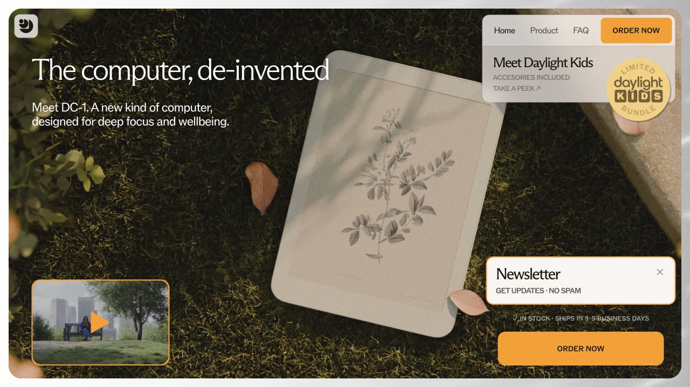

## 02 · Electronic Materials Office

[Live source](https://electronicmaterialsoffice.com/) · Physical product

**Industrial restraint gains personality from one luminous accent and an unexpectedly elegant serif.**

**Visual anatomy.** A black keyboard spans almost the entire viewport on a black stage. Light catches edges and surfaces rather than revealing every detail equally. The large serif product name sits at the lower left; a compact reserve panel balances it on the right. A small red-orange light in the corner is echoed by the glowing action button and a colored hardware detail. Rounded dark macro-image panels continue the product study below.

**Observed behavior.** Scrolling moves from the overall keyboard to tight views of keycaps, perforations, and a projecting control. A slim translucent header retains brand and action. The sequence changes scale while preserving the same material language.

**Transfer to new work.** Use an overall view to establish recognition, then a few specific close-ups to show why the object is desirable. Align accent color with an actual product feature. Pair a characterful display face with plain explanatory text rather than making every element look technical.

**Risks and limits.** Near-black renders need careful highlight placement and a useful fallback image. Glow should identify the action, not become a border treatment on every surface. Purchase flow and motion fallback were not tested.

**Inspection scope.** Desktop opening and scrolled macro-detail sequence.

**Captured steps — visual capture complete:**

1. [Overall product with serif title and luminous action](../evidence/02-emo-hero.jpg).
2. [Macro details and persistent purchase navigation](../evidence/02-emo-details.jpg).

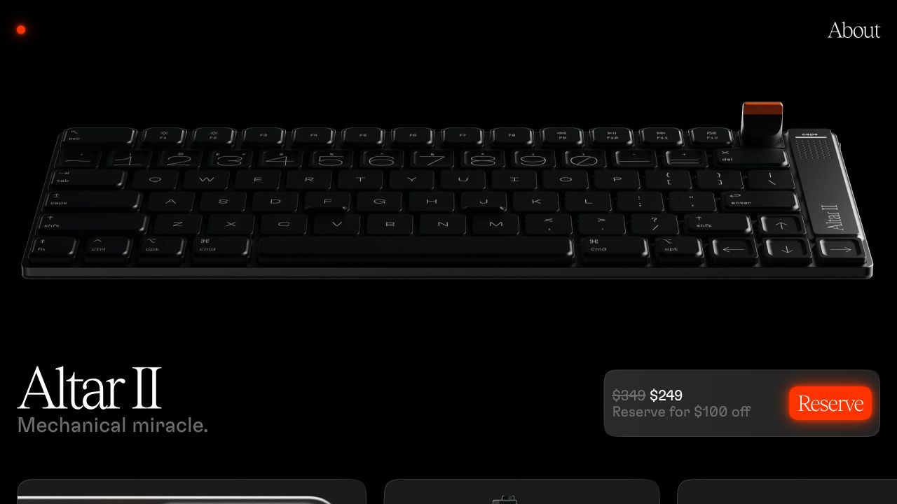

## 03 · Lando Norris

[Live source](https://landonorris.com/) · Photographic instrument

**A personal identity becomes a kinetic portrait rather than a conventional sports landing page.**

**Visual anatomy.** The initial composition centers a large portrait while ribbons of helmet imagery intersect the face. Pale topographic lines add an environmental layer. The name lockup mixes serif and heavy sans lettering, while tiny factual modules and a bright lime store control sit at the edges. The next sampled scene shifts to a dark olive field, very large type, a smaller portrait, and an oversized lime signature.

**Observed behavior.** The portrait/helmet treatment changes as the opening runs. Scrolling replaces the pale portrait stage with a dark identity statement. The accent and topographic motif preserve continuity despite the large composition change.

**Transfer to new work.** Build a motion motif from the subject itself: equipment, signature, track, rhythm, or material. Use one clear accent to connect imagery, actions, and identity. Keep compact factual information in consistent edge positions so spectacle has an anchor.

**Risks and limits.** A face-deformation effect is highly specific to this identity and is not a general premium-UI technique. Verify moving-image legibility and provide a quiet alternative. Store, menu, and touch behavior were not exercised.

**Inspection scope.** Desktop portrait opening and the following identity scene.

**Captured steps — visual capture complete:**

1. [Portrait and helmet-ribbon opening](../evidence/03-lando-hero.jpg).
2. [Olive, lime, signature, and large-type identity scene](../evidence/03-lando-scroll.jpg).

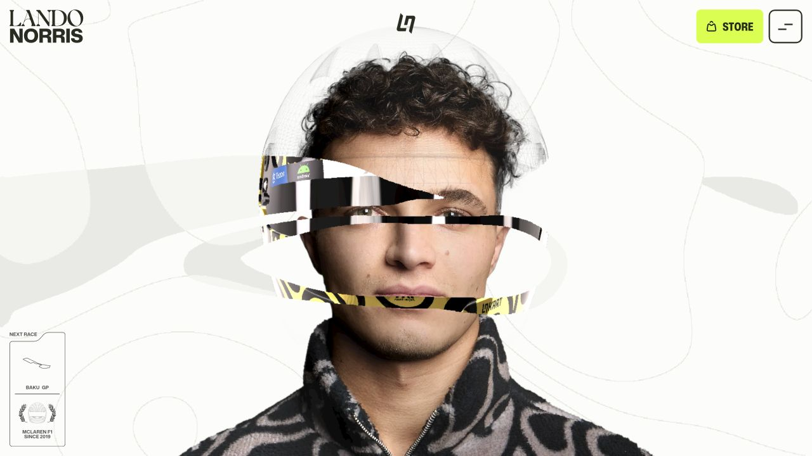

## 04 · Immersive Garden

[Live source](https://immersive-g.com/) · Immersive collection

**Luxury is expressed through quiet depth and atmosphere rather than visual density.**

**Visual anatomy.** The opening is a nearly white sculptural field with birds, insects, and organic forms that resemble shallow relief. Black serif copy runs across the middle; the studio mark, scroll instruction, menu, and sound control are sparse. Much of the composition is intentionally empty. The material is legible through soft shadows and restrained relief rather than strong color.

**Observed behavior.** After the loading stage, the relief scene becomes visible. Scrolling brings a larger serif statement through the environment and begins the project sequence. The environment provides continuity while text changes scale. Sound is presented as an optional layer.

**Transfer to new work.** For an atmospheric brand, use one coherent environmental material, minimal interface chrome, and a small set of readable text positions. Build the static composition first. A proposed implementation could combine a semantic page with a decorative spatial layer and still-image fallback.

**Risks and limits.** The loading sequence and low-contrast material are real costs. Make content reachable if rendering fails, and avoid letting the atmospheric layer reduce text contrast. The exact renderer and animation implementation were not investigated.

**Inspection scope.** Desktop loaded opening and a scroll transition into editorial copy; no complete project flow.

**Captured steps — visual capture complete:**

1. [Loaded sculptural opening](../evidence/04-immersive-hero.jpg).
2. [Serif narrative inside the same environment](../evidence/04-immersive-scroll.jpg).

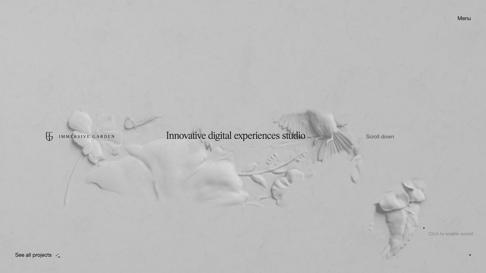

## 05 · Apple — Mac Studio

[Live source](https://www.apple.com/mac-studio/) · Physical product

**A familiar product becomes monumental through scale, precision, and disciplined sequencing.**

**Visual anatomy.** The opening centers a very large front-facing product render under a heavy, compact headline. The nearly white background and broad empty margins make the metal and perforations readable. Global navigation, product navigation, and the commercial strip have distinct scales. Scrolling retains a compact product header and changes to a black performance chapter with very large white typography.

**Observed behavior.** The sampled sequence moves from object recognition to purchase context and then a performance section. The change of background clearly marks a new chapter. Persistent product navigation keeps a practical route available during the narrative.

**Transfer to new work.** Assign each section a single question: what is it, why does it matter, how does it compare, and what should I do? Invest in clean renders and exact spacing. Large typography works because its surrounding detail is disciplined.

**Risks and limits.** Do not substitute arbitrary floating UI cards for the product study. The page changes over time; these captures document the version served on the research date, not a permanent Apple template. No purchase or full specification review was performed.

**Inspection scope.** Desktop opening and performance-chapter entry.

**Captured steps — visual capture complete:**

1. [Oversized product study and centered hierarchy](../evidence/05-apple-hero.jpg).
2. [White-to-black chapter transition with persistent navigation](../evidence/05-apple-highlights.jpg).

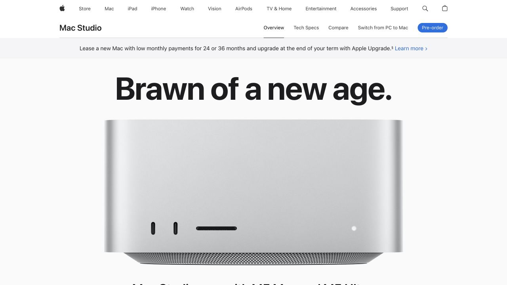

## 06 · Zhenlong Wu

[Live source](https://zhenlong.design/) · Editorial studio

**A strong portfolio can be built from typography, hierarchy, and unequal image scale without elaborate decoration.**

**Visual anatomy.** The page uses a black canvas, clean white sans text, and a four-part header with identity, navigation, local time, and an external profile. The introductory statement is large but comfortably left aligned. Below, project images fill unequal columns and captions sit outside them. A small category label, larger title, client, and year form a compact information hierarchy.

**Observed behavior.** The sampled scroll moves directly into project evidence. The gallery changes image width and vertical placement while retaining coherent labels. A compact menu appears in the scrolled header. One project is labeled as protected in the accessibility representation.

**Transfer to new work.** Give projects distinct scale according to visual material and importance. Keep enough common alignment and caption structure that asymmetry feels intentional. Separate descriptive metadata from expressive artwork rather than placing every project inside a decorated card.

**Risks and limits.** The layout relies on strong project imagery. Unequal columns must be reconsidered for phones and long titles. Protected work was not opened, and project routes were not audited.

**Inspection scope.** Desktop introduction and first project group.

**Captured steps — visual capture complete:**

1. [Large statement and unequal first project columns](../evidence/06-zhenlong-hero.jpg).
2. [Outside captions, metadata, and varied media scale](../evidence/06-zhenlong-projects.jpg).

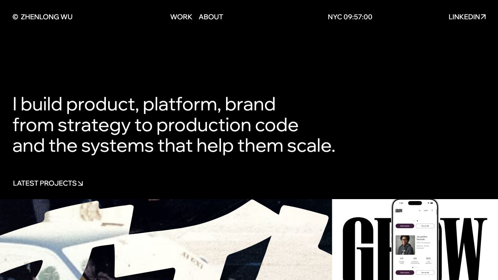

## 07 · Remy Shoots

[Live source](https://www.remyshoots.co.za/) · Photographic instrument

**The portfolio behaves like a photographic viewing instrument, with images as the substance and controls as precision markings.**

**Visual anatomy.** On desktop, a charcoal field carries compact mono labels at the top and bottom. A colored central portrait is flanked by darker, desaturated neighbors. Red triangular pointers and ruler-like ticks repeatedly identify the active position. The brand is small because the photographs carry the identity. Grid and list modes reorganize the same collection: the grid fills the field with photographs, while the list leaves large black regions around a central image and spreads metadata horizontally. Sampled label CSS declared Roboto Mono at about 13.44px with tight line-height and tracking.

**Observed behavior.** The entry offers sound or a quiet path. Slider, grid, and list controls were exercised; the active project remained recognizable in the inspected transitions. The optional fisheye control introduced a curved, magnified treatment. Selecting the active photograph opened a white project view with adjacent vertical images, compact project identity, a counter, and the same tick-mark vocabulary. At 390px, the experience became a full-height portrait with a curved lower caption frame. The mobile menu opened as a right-aligned list over a blurred photograph.

**Transfer to new work.** The valuable mechanism is continuity: one collection, one active identity, several useful representations, one repeated framing language. A new gallery should derive all modes from one data model and preserve selection. Use a photographic subject whose crop still has power on a phone. Choose a few original framing details and repeat them; do not borrow the whole red-and-mono identity. Translate the same idea into an app as list/grid continuity and a clear selected-item inspector.

**Risks and limits.** The entry gate, custom image navigation, tiny labels, and optional distortion all add friction. Keep work reachable through ordinary links, make controls usable by keyboard and touch, and ensure a reduced-motion version preserves content. A custom renderer or exact transition timing cannot be established from these captures. The research did not verify every project, gesture mode, keyboard path, or assistive-technology behavior.

**Inspection scope.** Deep sample: desktop entry, three modes, fisheye, one project opening, mobile gallery, and mobile menu. This is the most extensively exercised gallery reference.

**Captured steps — visual capture complete:**

1. [Entry: sound choice and precision-mark motif](../evidence/07-remy-intro.jpg).
2. [Slider: active color image with muted neighbors](../evidence/07-remy-slider.jpg).
3. [Grid: collection becomes a full-field image surface](../evidence/07-remy-grid.jpg).
4. [List: central image and distributed metadata](../evidence/07-remy-list.jpg).
5. [Optional lens treatment enabled](../evidence/07-remy-fisheye.jpg).
6. [Project detail: white field and adjacent image sequence](../evidence/07-remy-project.jpg).
7. [Phone composition: full-height portrait and lower caption](../evidence/07-remy-mobile.jpg).
8. [Phone menu: right-aligned links over blurred content](../evidence/07-remy-mobile-menu.jpg).

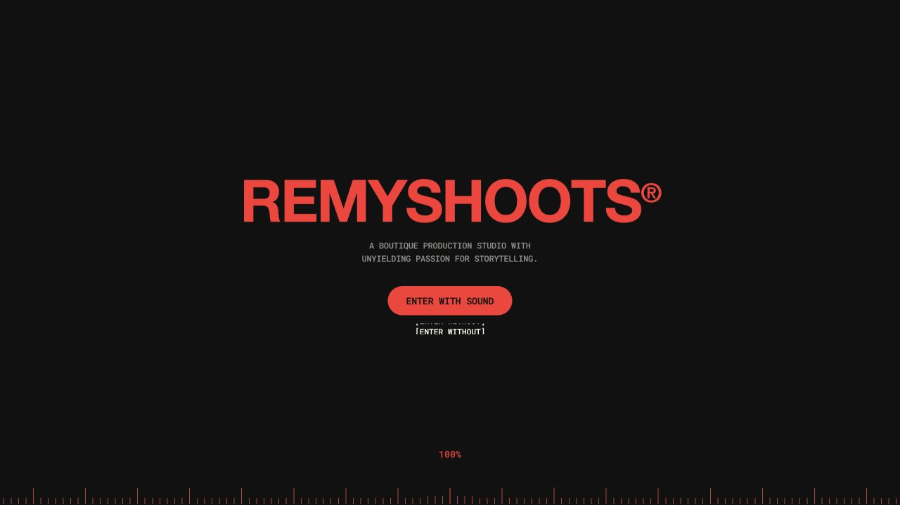

## 08 · Raycast

[Live source](https://www.raycast.com/) · Precision software

**A utility feels desirable when the promotional world and the actual interface share the same precision.**

**Visual anatomy.** The near-black opening uses a luminous red diagonal motif behind a centered, relatively simple sans headline. A wide translucent navigation panel sits above it. The sampled CSS declared Inter, a 64px/70.4px hero heading, and 18px introductory text. Further down, a large desktop demonstration shows a command-style interface, a selected item, a preview, metadata, and keyboard affordances. Thin boundaries and controlled surface contrast create depth without bright outlines everywhere.

**Observed behavior.** The page moves from a clear promise into a product demonstration. The sampled demonstration showed clipboard-history search and a concrete selected result. The demonstration was observed as page media; it was not treated as an installed application or a functional web replica.

**Transfer to new work.** For software marketing, show a real task and its result. Match the demonstration to the product’s actual density, labels, icons, and shortcuts. In the app itself, retain focused command surfaces and clear selection rather than importing the large atmospheric hero.

**Risks and limits.** Dark muted text and translucent layers need contrast checks. A looping demo should have a useful static poster. Do not mistake visible product media for tested app functionality.

**Inspection scope.** Desktop hero, measured type samples, and a loaded product-demonstration frame.

**Captured steps — visual capture complete:**

1. [Red diagonal atmosphere around a focused value proposition](../evidence/08-raycast-hero.jpg).
2. [Concrete launcher task with selected result and detail preview](../evidence/08-raycast-demo.jpg).

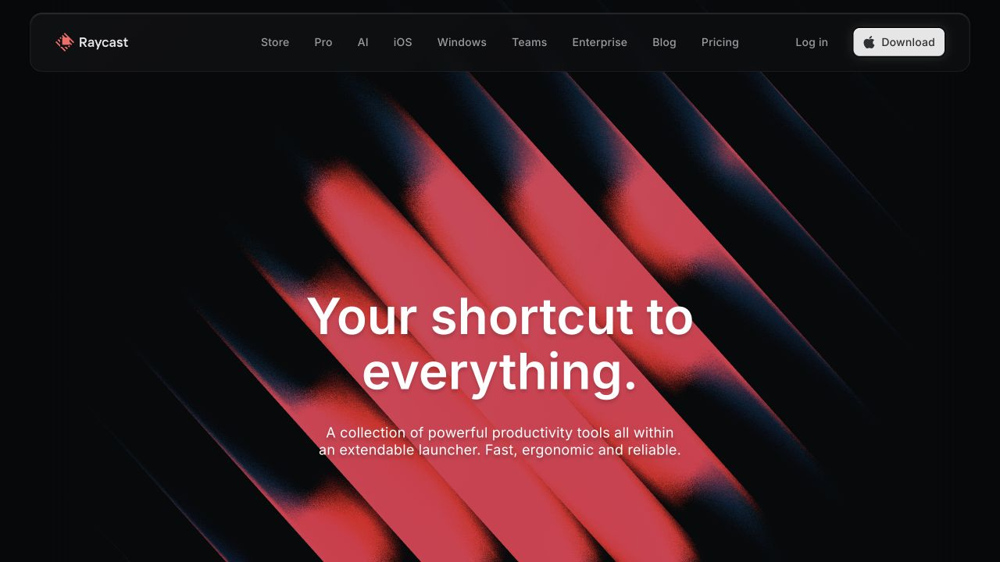

## 09 · Studio Loop

[Live source](https://www.studioloop.com.br/) · Editorial studio

**Playfulness works because the objects, type, and spacing are art-directed as one composition.**

**Visual anatomy.** The opening places a moving diagonal collage of printed pieces, furniture, apparel, and other studio objects over a deep brown field. An orange script-like brand mark anchors the cluster. Small navigation remains conventional and quiet. The service section replaces objects with large type: sans and serif words mix within a line, underlines act as emphasis, small numbers add rhythm, and faint rules divide generous rows. The next captured section switches to an off-white field, a large editorial paragraph, mixed font emphasis, and scattered orange circular accents. Brown, orange, cream, and lavender create a more specific palette than generic black and white.

**Observed behavior.** Scrolling changes the dominant medium from collage to type to explanatory copy. The Schoolhouse case study becomes calmer: a very large title, broad empty space, and an offset metadata table. Its sampled title declared neoFormaSans at 120px with 100.8px line-height and −2.4px tracking. At 390px, the hero is a new portrait crop. Opening the mobile menu revealed staggered links, alternate serif/sans treatments, and brand colors over a charcoal field.

**Transfer to new work.** Build expressive pages around changes in density and medium. Treat each typeface switch as emphasis, not random styling. Give each collage object a role in the brand story and establish a controlled visual path. Reserve a calm typographic system for project details so the work can be understood. For a mobile menu, compose the links as a new poster while retaining obvious targets and a clear close control.

**Risks and limits.** Overlap can obscure text, especially in narrow or transitional states. Low-opacity reading text and thin typography need verification. The original object art and font files are not included for reuse. The full menu focus cycle, form submission, and complete case-study media sequence were not tested.

**Inspection scope.** Deep sample: desktop collage, services, editorial section, Schoolhouse case opening, phone hero, and opened phone menu.

**Captured steps — visual capture complete:**

1. [Diagonal material collage on brown](../evidence/09-loop-hero.jpg).
2. [Numbered services with purposeful serif/sans contrast](../evidence/09-loop-scroll.jpg).
3. [Cream editorial section with orange accents](../evidence/09-loop-editorial.jpg).
4. [Calm case-study title and offset metadata](../evidence/09-loop-case.jpg).
5. [Portrait art direction](../evidence/09-loop-mobile.jpg).
6. [Full-screen typographic mobile menu](../evidence/09-loop-mobile-menu.jpg).

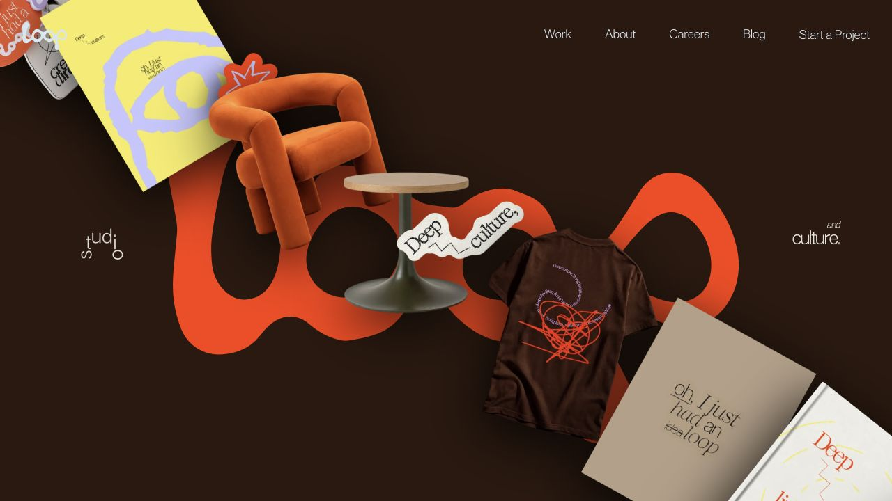

## 10 · Nick Ho Motorsports

[Live source](https://nickho-motorsports.nl/) · Photographic instrument

**A strict visible grid makes motorsport imagery feel measured and competitive.**

**Visual anatomy.** A monochrome racing photograph fills the opening behind fine vertical lines. A huge condensed race number occupies the center; compact statistics and personal information align to the sides. The driver name sits low on the left and an event countdown on the right. The only strong color in the opening is a small yellow menu button. Below, the page turns white and uses tightly stacked condensed type with selected yellow words and offset racing photographs.

**Observed behavior.** The inspected scroll changes from a dense photographic hero to a typographic statement without abandoning the grid or condensed lettering. Numerical modules make the subject’s performance legible at a glance.

**Transfer to new work.** Use a visible grid when it reinforces the domain: timing, performance, measurement, or engineering. Set tabular data compactly and reserve large condensed type for a small amount of high-impact information. Keep yellow accents tied to emphasis or action.

**Risks and limits.** Condensed blocks can become difficult to read in long passages. A countdown is a time-sensitive content element, not a decorative placeholder to copy. Menu, race details, and small-screen behavior were not exercised.

**Inspection scope.** Desktop hero and following editorial statement.

**Captured steps — visual capture complete:**

1. [Monochrome image, visible grid, statistics, and race number](../evidence/10-nickho-hero.jpg).
2. [White statement section with yellow emphasis](../evidence/10-nickho-story.jpg).

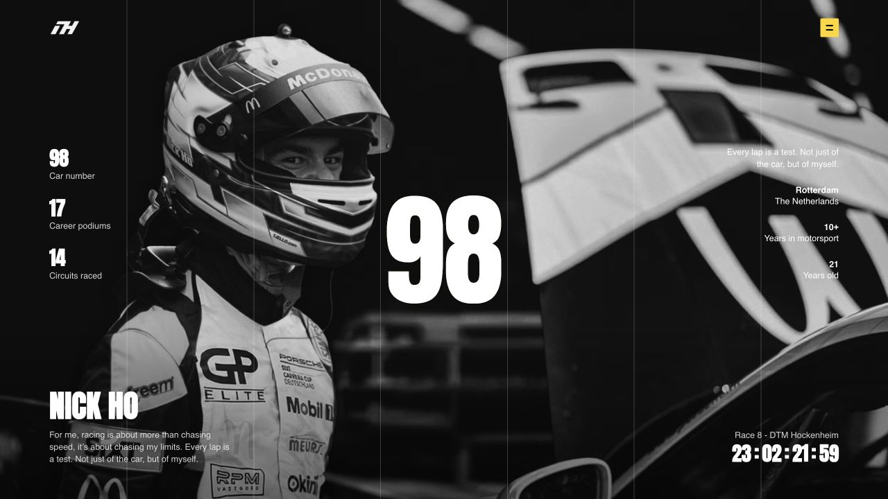

## 11 · Locomotive

[Live source](https://locomotive.ca/en) · Editorial studio

**Its confidence comes from typographic contrast, editorial space, and a willingness to let different sections have different forms.**

**Visual anatomy.** The hero combines full-window moving imagery with a low-positioned serif identity statement and several small graphic marks. The top navigation is unusually plain and large: links read like a short sentence. The next sampled composition isolates an award object with captions placed around it and a separate ruled action. The work index becomes large centered serif project names divided by thin black rules, with a small image appearing within the list. The Lightship case opening uses a loose editorial grid: title at lower left, categories at upper right, and year, location, and media on distinct alignments. The inspected hero declared LocomotiveNew at 70/77px and the navigation HelveticaNowDisplay at 26/31.2px.

**Observed behavior.** Scrolling changes medium and density rather than repeating one card layout. The Lightship route was opened and visually inspected. On a 390px viewport, the navigation becomes a menu, the mixed hero lockup wraps into a compact multiline block, and lower link lists retain indentation and rules. The screenshots establish those compositions; hover behavior and precise animation timing were not independently measured.

**Transfer to new work.** Think like an editor: which content deserves a full field, which deserves a single object, which is better as a list, and which needs a quiet metadata grid? Keep a small vocabulary of type roles and rules so this variety still belongs together. Pair an expressive title face with very ordinary navigation. For apps, transfer the disciplined hierarchy and spacing rather than using 100px project titles in a working table.

**Risks and limits.** Large display text needs planned wrapping and long-name handling. Small interactive imagery in a list should not be the only indication that the row is actionable. Video-background contrast, focus behavior, and all project pages remain outside this sample. The site’s own font names are evidence, not reusable font assets.

**Inspection scope.** Deep sample: clean desktop hero, award composition, work index, Lightship case opening, phone hero, and a lower phone editorial list.

**Captured steps — visual capture complete:**

1. [Moving-image hero with serif lockup and simple navigation](../evidence/11-locomotive-hero.jpg).
2. [Isolated object and offset captions](../evidence/11-locomotive-work.jpg).
3. [Large serif project list with dividing rules](../evidence/11-locomotive-projects.jpg).
4. [Lightship case: title, category, and metadata grid](../evidence/11-locomotive-case.jpg).
5. [Phone hero with wrapped lockup](../evidence/11-locomotive-mobile.jpg).
6. [Phone editorial links with persistent grid logic](../evidence/11-locomotive-mobile-work.jpg).

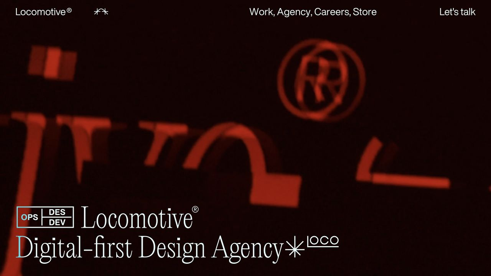

## 12 · Active Theory

[Live source](https://activetheory.net/work) · Immersive collection

**The portfolio is presented as an inhabitable collection rather than a flat list of thumbnails.**

**Visual anatomy.** Project panels occupy a dark spatial scene around a vertical sculptural form. Iridescent surfaces, particles, colored atmospheric light, and tilted image planes create depth. Monospaced category links sit in a quiet left-hand column; a small work/contact capsule remains at the upper right. The panels themselves carry the major imagery and titles.

**Observed behavior.** After a visible loading sequence, the scene revealed project panels. A scroll moved the arrangement from the first featured panel toward another, changing their relative size and position while the navigation remained stable. The accessibility representation exposed named project links despite the spatial presentation. It also reported an unable-to-play-media state; full media and audio behavior were not verified.

**Transfer to new work.** A spatial gallery needs a useful organizing relationship, not merely floating cards. Keep selection clear, navigation stable, and project links available in ordinary form. Let atmospheric detail support the panels rather than compete with their content.

**Risks and limits.** Loading cost, low-contrast utility text, motion sensitivity, and GPU performance are central trade-offs. Do not claim that a similar appearance requires the same rendering stack. Keyboard, phone, and reduced-motion paths were not audited.

**Inspection scope.** Desktop loaded spatial gallery and one scroll-driven transition.

**Captured steps — visual capture complete:**

1. [Loaded spatial collection with persistent category navigation](../evidence/12-activetheory-hero.jpg).
2. [Project planes change position and emphasis](../evidence/12-activetheory-scroll.jpg).

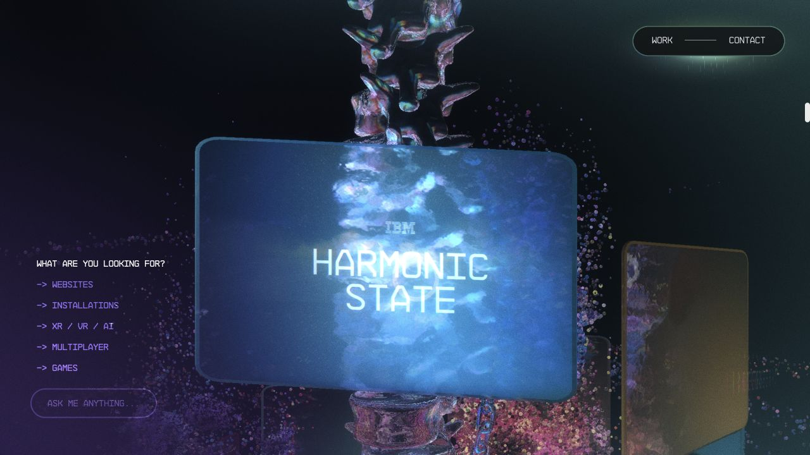

## 13 · Parakeet

[Live source](https://parakeet.co/) · Tactile icons

**The important reference is the distinction between memorable app identities and coherent utility glyph families.**

**Visual anatomy.** The page uses a saturated blue field, a translucent rounded navigation surface, a playful display face, and two illustrated portraits with layered colored halos. The app-icon gallery gives each square icon enough room to show material, silhouette, and internal depth. Examples vary from flat symbolic forms to carefully rendered objects. The glyph boards are more disciplined: each client family has a common visual weight, shape character, and limited palette. A visible grid lets differences in mass and alignment be compared.

**Observed behavior.** The inspected scroll moves from an introduction to app icons and then to glyph boards. At 390px, the portraits move above the text, the wordmark becomes a compact bird mark, and selected navigation remains visible. The first row of app icons stays large enough to inspect.

**Transfer to new work.** Design app identity and utility glyphs as separate systems. For a glyph family, compare silhouettes, optical weight, corner character, and padding together. For an app icon, choose one central metaphor and one consistent material story. Review actual-size exports rather than only large presentation art.

**Risks and limits.** Different client app icons are not one family to mix into a new interface. Large-gallery craftsmanship does not automatically survive at 16px. The bright background is a presentation choice, not a required palette for a productivity app. No assets were downloaded or licensed.

**Inspection scope.** Desktop introduction, app-icon gallery, client glyph boards, and phone opening.

**Captured steps — visual capture complete:**

1. [Studio identity and illustrated portraits](../evidence/13-parakeet-intro.jpg).
2. [App icons: silhouette, central metaphor, and material](../evidence/13-parakeet-app-icons.jpg).
3. [Glyph board: shared construction within a family](../evidence/13-parakeet-glyphs.jpg).
4. [Phone adaptation with compact mark and large icons](../evidence/13-parakeet-mobile.jpg).

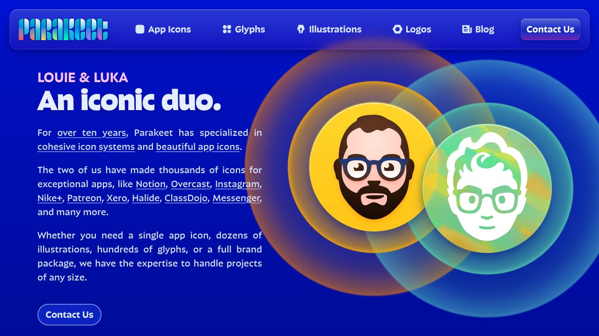

## 14 · Adoratorio

[Live source](https://adoratorio.studio/) · Editorial studio

**A spare editorial frame can hold an experimental visual texture without losing the studio’s identity.**

**Visual anatomy.** A pale gray field carries faint, character-like trails across most of the screen. Small studio information, location, time, and contact text align across the top. An enormous black wordmark sits on the lower edge and establishes scale. At the start of the work section, a narrow tabular row shows a project number, title, service categories, year, and a colored indicator; show/hide controls sit at the edge.

**Observed behavior.** The sampled scroll progressively brings the wordmark and first work row into view. The page exposes dedicated controls for jumping to work, awards, and press. The research sampled the opening and the beginning of the index rather than a full case-study route.

**Transfer to new work.** Combine a stable information grid with one experimental background behavior. Let the wordmark establish the visual scale and make the project index compact and functional. Keep experimental texture subordinate to readable foreground information.

**Risks and limits.** Faint detail is appropriate for decoration, not for important labels. Large wordmarks need a narrow-screen strategy. The precise character effect, full project transitions, and accessibility behavior were not established.

**Inspection scope.** Desktop opening and beginning of the project index; deeper portfolio flow is outside the sample.

**Captured steps — visual capture complete:**

1. [Huge lower wordmark and faint experimental texture](../evidence/14-adoratorio-hero.jpg).
2. [Transition into a compact project index](../evidence/14-adoratorio-work.jpg).

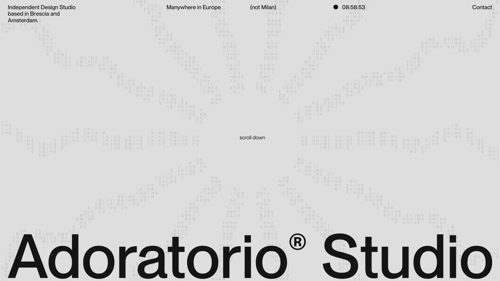

## 15 · MONOGRID

[Live source](https://www.monogrid.com/en/) · Immersive collection

**A loud identity animation is balanced by a recognizable portfolio structure.**

**Visual anatomy.** The opening uses an electric-blue wordmark distorted around large moving forms on a black field. The fixed central logo is much smaller and steadier. Small monospaced utility labels and lime controls frame a large white introductory paragraph. The work area becomes an offset image grid with blue category tags, light project titles, and explanatory descriptions. A lime all-projects action creates a second functional accent.

**Observed behavior.** The hero’s blue forms change shape while interface anchors remain fixed. Scrolling reveals real project media and a conventional route into the work. Cookie and language overlays were dismissed to inspect the underlying page.

**Transfer to new work.** Let a single brand motif be extreme while navigation and project evidence stay clear. Use accent roles consistently: an expressive brand color can differ from a functional action color. Ground an experimental opening with useful descriptions and recognizable project links.

**Risks and limits.** Moving text imagery can compete with the actual introduction. Check contrast across the whole animation. Tags that are tiny on desktop should not become the sole way to understand projects. Case pages and mobile behavior were not tested.

**Inspection scope.** Desktop opening after notices and a featured-work section.

**Captured steps — visual capture complete:**

1. [Blue identity animation with stable controls](../evidence/15-monogrid-hero.jpg).
2. [Offset project grid, category tags, and lime action](../evidence/15-monogrid-work.jpg).

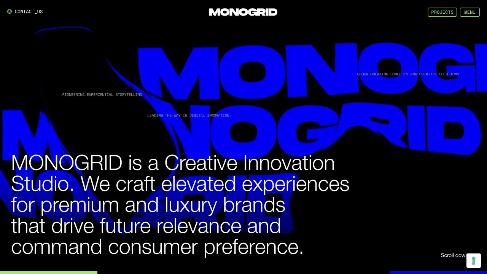

## 16 · Victor Work

[Live source](https://victor.work/) · Editorial studio

**A personal portfolio becomes a strongly authored editorial object through type, color, and an explicit experience concept.**

**Visual anatomy.** A cream page sits inside a dark navy outer frame. Extremely condensed brick-red display lettering fills the entry. Small navy text and a quiet pill action contrast with that weight. The experience selector uses illustrated cards and different levels of visual intensity. The main page, reached through the visible skip option, retains the oversized red identity and a large navy statement above several compact interest columns.

**Observed behavior.** The entry, experience-level selection, and customization screen were inspected. The customization screen asked for a name and additional preferences; no personal information was entered. The skip path was then used successfully to reach the main portfolio. This demonstrates both a memorable entrance and the value of a direct route past it.

**Transfer to new work.** Use a coherent, limited palette and pronounced typographic contrast to create personality. If a site offers an elaborate introduction, retain a clearly discoverable fast path. A more expressive experience can coexist with a simple professional view.

**Risks and limits.** Multi-step onboarding is a substantial cost before visitors see the work. Do not import it into ordinary service or app flows without a reason. Some underlying project media reported playback limitations; full case-study media and customized settings were not tested.

**Inspection scope.** Desktop entry, experience chooser, customization screen observation, and successful skip to the main page.

**Captured steps — visual capture complete:**

1. [Cream, navy, and condensed red entry](../evidence/16-victor-hero.jpg).
2. [Main portfolio after using the fast-entry option](../evidence/16-victor-main.jpg).

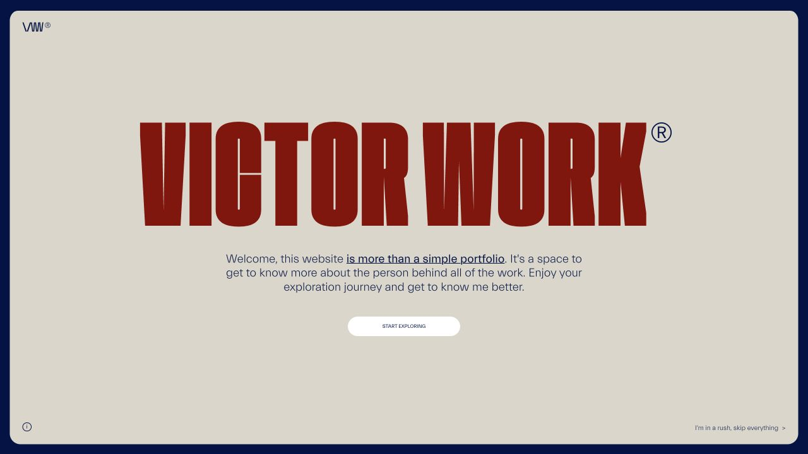

## 17 · Weird Folders

[Live source](https://weirdfolders.com/) · Tactile icons

**A shared folder silhouette turns material experimentation into a recognizable collection.**

**Visual anatomy.** The catalog places richly rendered folder-shaped objects on a near-black field with understated uppercase captions. Recognizable tabs and compact silhouettes survive across metal, food, paper, plastic, and electronics. Detail is physical: worn edges, thickness, labels, dirt, highlights, shadows, and partial occlusion. The site’s small serif identity and restrained controls leave the objects dominant. A detail panel enlarges one object, adds a serif title, and places clear actions below it.

**Observed behavior.** An entry cluster resolves into the collection. Opening the metal-container icon produced a centered detail panel over a blurred catalog, with previous/next controls and keyboard-hint text. At a 390px viewport, the sampled gallery became two columns and the bottom registration action condensed into a narrow bar. Zoom and theme controls were visible; the research did not exercise purchasing or downloads.

**Transfer to new work.** Hold shape, viewpoint, baseline, and lighting consistent while varying material and subject. Make details support recognition rather than replace the primary silhouette. Use rich object art for categories and identity; retain simpler glyphs for repeated utility controls.

**Risks and limits.** Quiet captions and dense material detail need actual-size and contrast checks. The on-screen keyboard hint does not prove keyboard handling was tested. The source assets are not licensed for reuse by being visible in this research.

**Inspection scope.** Desktop settled catalog, one enlarged icon, and a settled two-column phone catalog.

**Captured steps — visual capture complete:**

1. [Material collection with a common folder silhouette](../evidence/17-weirdfolders-grid.jpg).
2. [Metal icon detail and centered information panel](../evidence/17-weirdfolders-detail.jpg).
3. [Phone catalog preserves object size in two columns](../evidence/17-weirdfolders-mobile.jpg).

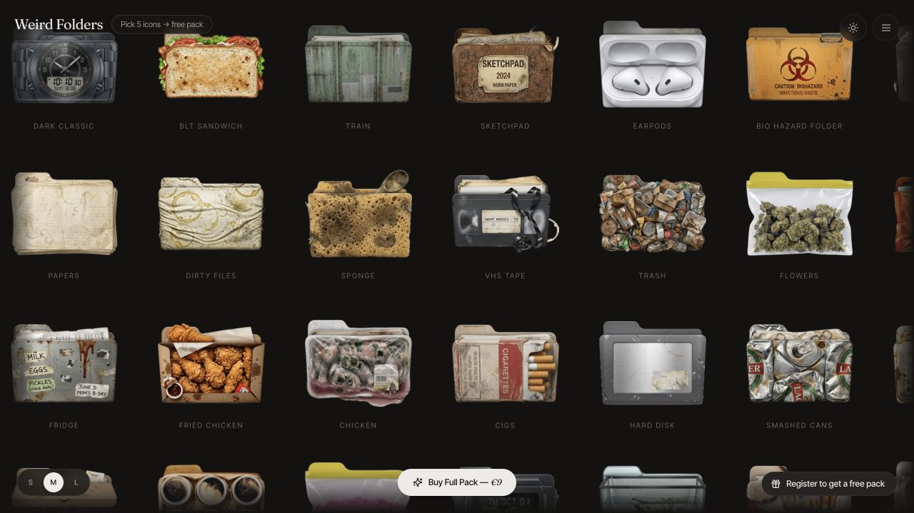

## 18 · Filmbot

[Live source](https://filmbot.com/) · Editorial studio

**A business software proposition gains cultural character through a cinematic graphic motif.**

**Visual anatomy.** The opening splits into a left image field and a right typographic field. Repeated rounded cuts mask the moving image into a distinctive vertical pattern. Large heavy black text dominates the light right side. A narrow mono news strip runs at the top and a coral contact action occupies a corner. Below, an editorial statement uses a much lighter sans treatment, with compact supporting copy and offset image fragments.

**Observed behavior.** The inspected scroll changes from the split hero to a broad statement about the product’s audience and then the start of visual proof. The graphic mask, compact utility text, and strong display type make a software business feel related to cinema.

**Transfer to new work.** Derive a graphic motif from the product’s cultural context and repeat it sparingly. Combine a distinctive introduction with practical product explanation. A business site can be expressive without abandoning its purpose or making all navigation experimental.

**Risks and limits.** A mask should improve the image composition rather than make the subject unreadable. The news strip can compete with primary content. Ticketing, forms, and mobile behavior were not tested.

**Inspection scope.** Desktop split hero and following editorial statement.

**Captured steps — visual capture complete:**

1. [Split composition with masked film imagery](../evidence/18-filmbot-hero.jpg).
2. [Editorial statement and offset visual proof](../evidence/18-filmbot-story.jpg).

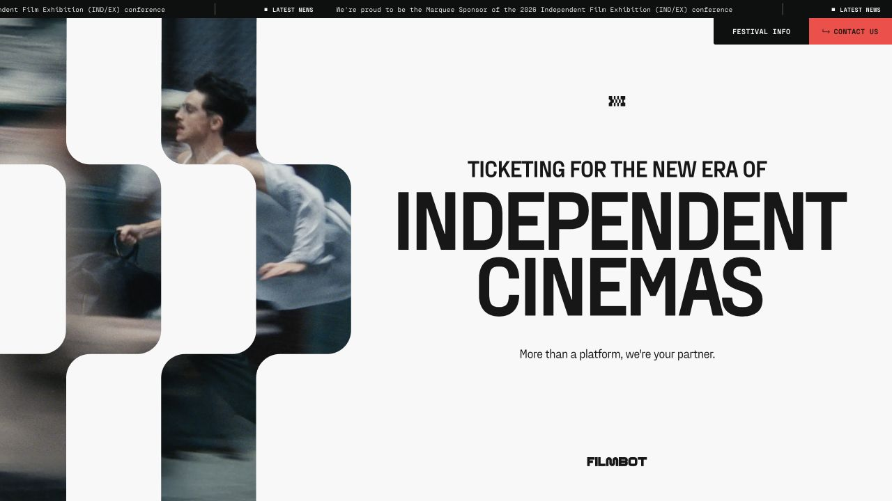

## 19 · Cartier — Le Chœur des Pierres

[Live source](https://www.cartier.com/en-fr/lechoeurdespierres) · Immersive collection

**The object’s color and light become the navigation language.**

**Visual anatomy.** Five gemstones sit on a softly lit white fabric-like field. Sparse controls and an asymmetrical serif title let scale, translucency, shadow, and reflected color carry the composition. Selecting the green stone changes the scene to a close-up necklace against a green environment, retaining the brand mark and a clear close control.

**Observed behavior.** Region and cookie notices were dismissed. The gemstone selection was exercised, sound was switched off, and the green-stone jewelry scene opened. The source was accessible in the browser even though the text-fetch tool returned a 403.

**Transfer to new work.** Make selection feel continuous by carrying the selected object’s material or color into its detail scene. Use the same light direction and a restrained control vocabulary. Provide an ordinary item list alongside immersive navigation in new work.

**Risks and limits.** Visual stone selection needs explicit semantic alternatives. Full jewelry-story scrolling, keyboard interaction, and mobile behavior were not tested.

**Inspection scope.** Desktop campaign entry, selection state, and one opened jewelry scene.

**Captured steps — visual capture complete:**

1. [Gemstones as the campaign’s visual anchor](../evidence/19-cartier-entry.jpg).
2. [Stone-selection state](../evidence/19-cartier-scene.jpg).
3. [Selected green stone becomes a jewelry environment](../evidence/19-cartier-emerald.jpg).

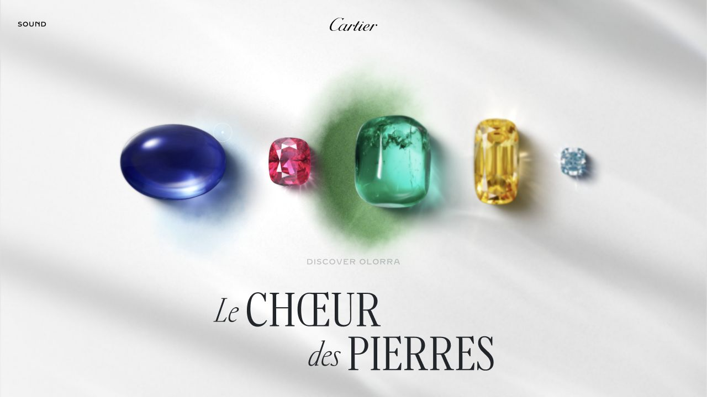

## 20 · Leonardo Moreira

[Live source](https://leonardomoreira.com.br/) · Tactile icons

**A familiar computer metaphor becomes a complete visual world when its details remain consistent.**

**Visual anatomy.** The opening imitates a retro BIOS boot display, including monospaced text and a curved-screen treatment. It resolves into a teal desktop with cream application tiles and a broad bottom dock. Opening the folder control reveals a file-manager window with breadcrumbs, a sidebar, column labels, folder rows, and a close control. Slight texture and curvature connect the boot screen, desktop, and window.

**Observed behavior.** The boot sequence was allowed to complete and the folder control was opened. The result visibly behaved as a window within the simulated desktop. The browser accessibility representation exposed the experience primarily as a single canvas image, which limits what could be verified through semantics.

**Transfer to new work.** If using a metaphor, carry it through navigation, controls, content containers, states, and motion. A coherent small world is stronger than a conventional page with one retro decoration. For a real app, keep familiar operations and keyboard behavior even if the surface is playful.

**Risks and limits.** A simulated operating system can obscure the actual portfolio and add entry delay. Canvas-only content needs an accessible alternative. Games, keyboard controls, and window management beyond opening the folder were not tested.

**Inspection scope.** Desktop boot sequence, settled desktop, and opened file-manager window.

**Captured steps — visual capture complete:**

1. [Retro boot as a deliberate entrance](../evidence/20-leonardo-boot.jpg).
2. [Settled teal desktop and cream dock](../evidence/20-leonardo-hero.jpg).
3. [File-manager window inside the same visual world](../evidence/20-leonardo-projects.jpg).

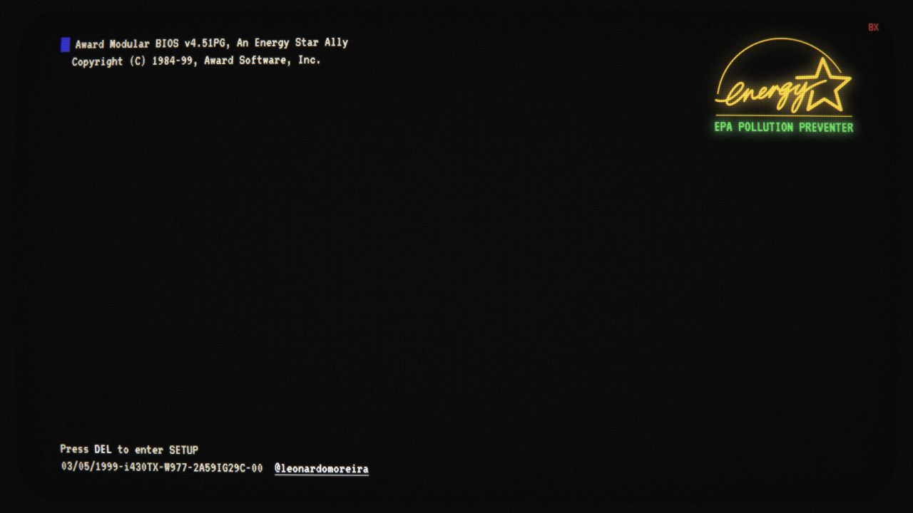

## 21 · 60fps — The Watch

[Live source](https://thewatch.60fps.fr/) · Immersive collection

**The product and the typographic composition move as one system.**

**Visual anatomy.** A detailed metal watch is centered over huge geometric lettering and a pale gray field. A fine circular diagram frames the object; small color and model labels occupy the edges. The next captured composition turns the watch obliquely and places it over a multiline technical statement. The neutral palette makes metal highlights and geometric structure prominent.

**Observed behavior.** After loading, a scroll changed the watch orientation and surrounding type composition. The page exposed model and material choices, but those controls were not exercised in this sample.

**Transfer to new work.** Use object orientation to support a chapter’s meaning and maintain material consistency throughout the story. Large typography can serve as spatial context when it remains readable. A proposed implementation needs a useful still sequence if the interactive scene fails.

**Risks and limits.** Do not infer the original renderer or exact motion curve from the effect. Full model selection, hold interactions, performance, and phone behavior were not tested.

**Inspection scope.** Desktop loaded product stage and one scroll-driven orientation change.

**Captured steps — visual capture complete:**

1. [Watch, enormous type, and technical diagram](../evidence/21-watch-hero.jpg).
2. [Object orientation and text composition change together](../evidence/21-watch-scroll.jpg).

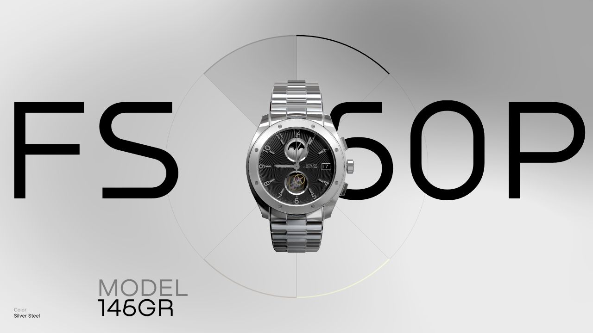

## 22 · UI8 — Forge

[Live source](https://ui8.ai/forge/) · Precision software

**A precise graphic grid gives software promotion the character of an engineered object.**

**Visual anatomy.** A charcoal field carries fine grid and circular construction lines with scattered warm points. A compact title sits beside a large app icon whose orange glowing object is enclosed by wire-like geometry. The explanation and two actions align underneath. The feature section pairs readable text with a large product-interface crop. Sampled section CSS declared Geist with tightly tracked 56px headings.

**Observed behavior.** The Explore control moved into product explanation. At 390px, title and icon remained in a compact two-column composition, while explanation and actions used the full width.

**Transfer to new work.** Let the icon, page construction, and real product screenshot share one visual vocabulary. Use a restrained accent for meaningful actions and material light. Preserve a clear explanation beneath the spectacle.

**Risks and limits.** Background construction lines should remain subordinate. Downloading, installing, or testing the actual app was outside this task.

**Inspection scope.** Desktop hero, Explore transition, measured section type, and phone opening.

**Captured steps — visual capture complete:**

1. [Compact grid, app icon, and warm accent](../evidence/22-forge-hero.jpg).
2. [Product screenshot and concrete explanation](../evidence/22-forge-features.jpg).
3. [Phone title/icon composition](../evidence/22-forge-mobile.jpg).

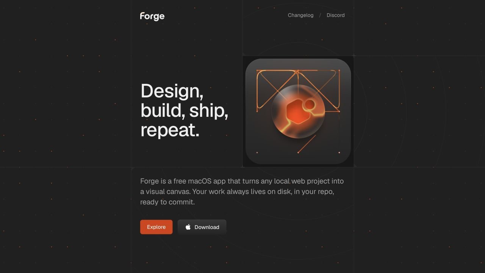
